```
    ___    ____  ________  _______
   /   |  / __ \/ ____/ / / / ___/
  / /| | / /_/ / / __/ / / /\__ \
 / ___ |/ _, _/ /_/ / /_/ /___/ /
/_/  |_/_/ |_|\____/\____//____/
```

# Argus v4.0

**A command-line cybersecurity toolkit for authorized testing, OSINT, and security research.**

Argus is a single-file Python application covering 20 tools across cryptography, network analysis, web vulnerability assessment, OSINT, packet analysis, and digital forensics.

> **Ethical Use Notice:** All offensive and active tools in Argus are intended for use on systems you own or have explicit written permission to test. Unauthorized use against third-party systems is illegal and unethical.

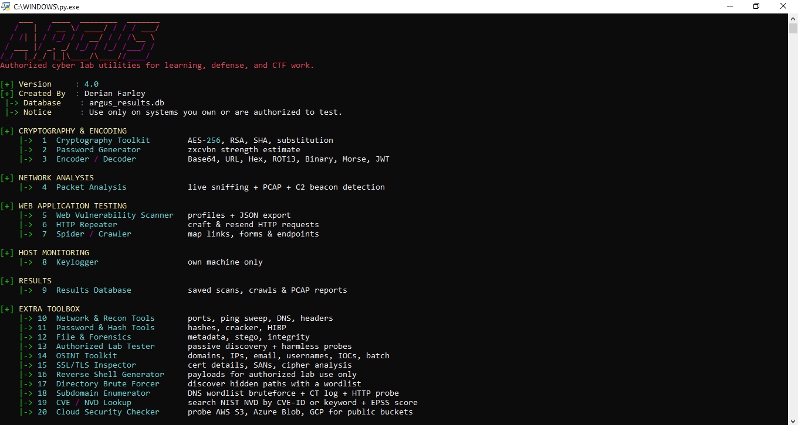

---

## Table of Contents

- [Screenshots](#screenshots)
- [Features at a Glance](#features-at-a-glance)
- [Requirements](#requirements)
- [Installation](#installation)
- [Configuration](#configuration)
- [Usage](#usage)
  - [Interactive Menu](#interactive-menu)
  - [CLI Mode](#cli-mode)
- [Tool Reference](#tool-reference)
  - [1. Cryptography Toolkit](#1-cryptography-toolkit)
  - [2. Password Generator](#2-password-generator)
  - [3. Encoder / Decoder](#3-encoder--decoder)
  - [4. Packet Analysis](#4-packet-analysis)
  - [5. Web Vulnerability Scanner](#5-web-vulnerability-scanner)
  - [6. HTTP Repeater](#6-http-repeater)
  - [7. Spider / Crawler](#7-spider--crawler)
  - [8. Keylogger](#8-keylogger)
  - [9. Results Database](#9-results-database)
  - [10. Network & Recon Tools](#10-network--recon-tools)
  - [11. Password & Hash Tools](#11-password--hash-tools)
  - [12. File & Forensics](#12-file--forensics)
  - [13. Authorized Lab Tester](#13-authorized-lab-tester)
  - [14. OSINT Toolkit](#14-osint-toolkit)
  - [15. SSL/TLS Inspector](#15-ssltls-inspector)
  - [16. Reverse Shell Generator](#16-reverse-shell-generator)
  - [17. Directory Brute Forcer](#17-directory-brute-forcer)
  - [18. Subdomain Enumerator](#18-subdomain-enumerator)
  - [19. CVE / NVD Lookup](#19-cve--nvd-lookup)
  - [20. Cloud Security Checker](#20-cloud-security-checker)
  - [System: Configure API Keys](#system-configure-api-keys)
- [Project Structure](#project-structure)
- [License](#license)

---

## Screenshots

<details>
<summary>Tool previews — click to expand</summary>

<br>

| | |
|:---:|:---:|
| **1 · Cryptography Toolkit** | **2 · Password Generator** |
| 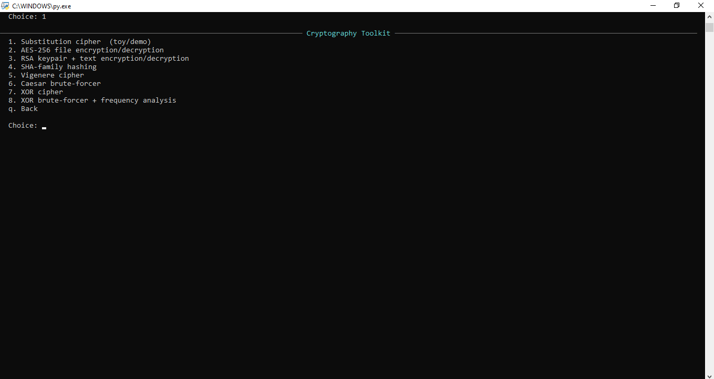 | 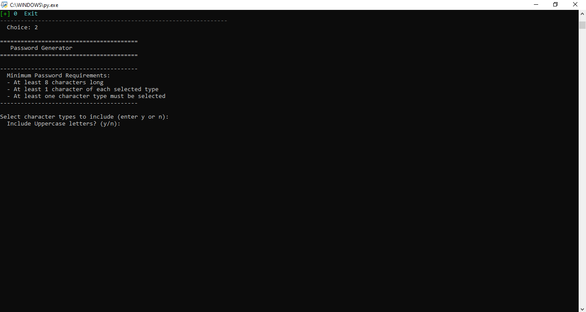 |
| **3 · Encoder / Decoder** | **4 · Packet Analysis** |
| 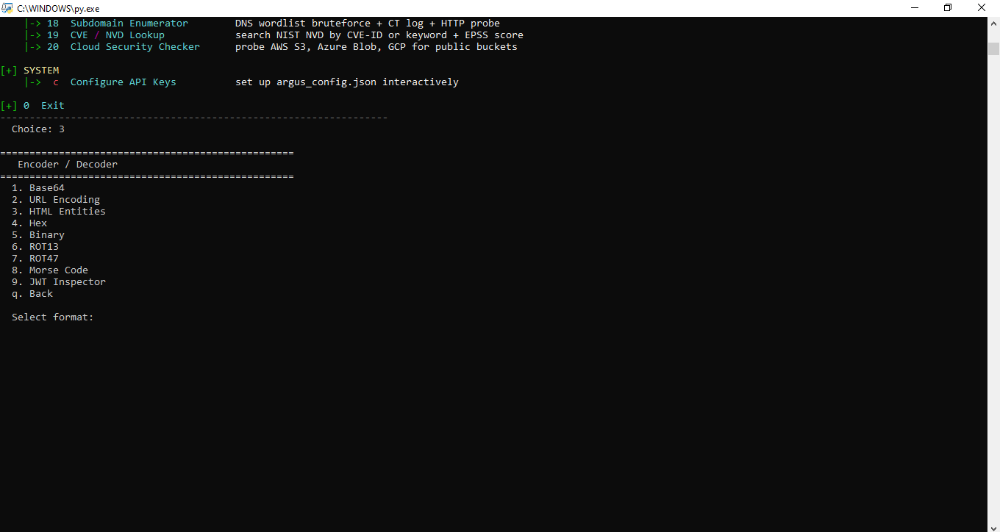 | 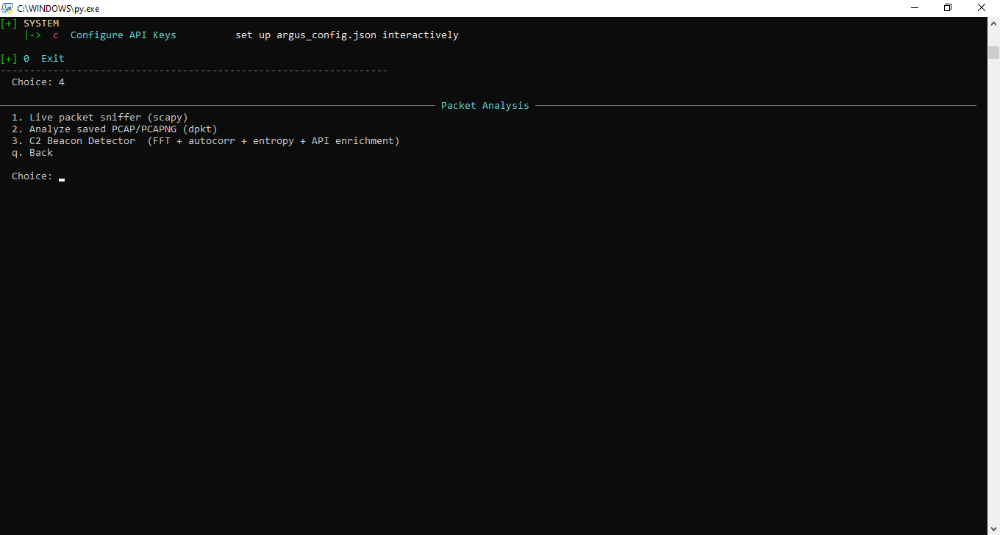 |
| **5 · Web Vulnerability Scanner** | **6 · HTTP Repeater** |
| 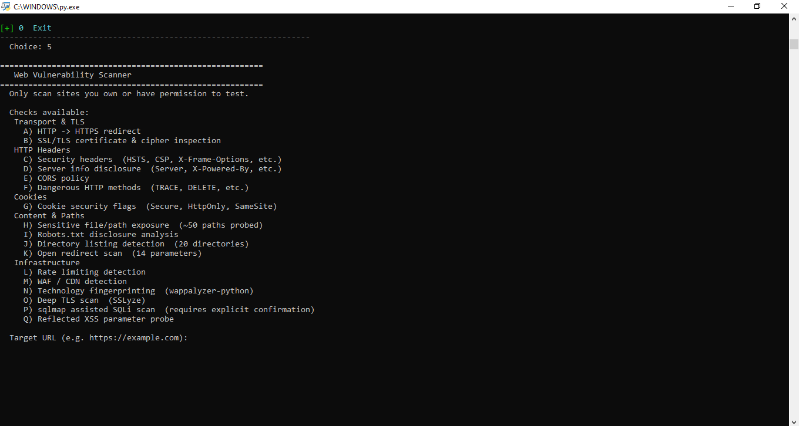 | 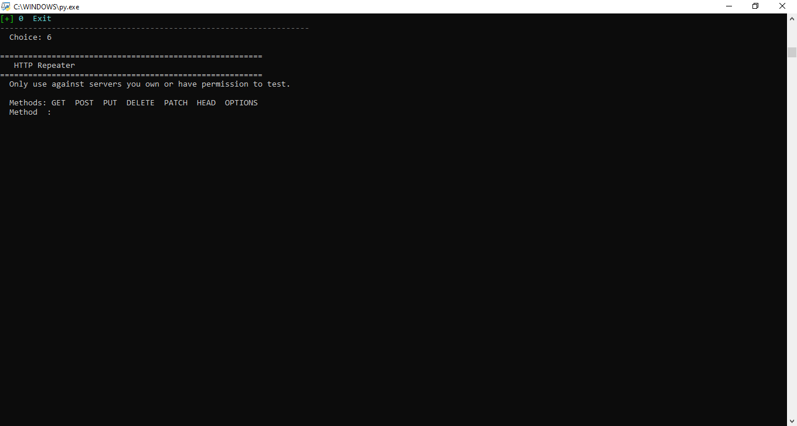 |
| **7 · Spider / Crawler** | **8 · Keylogger** |
| 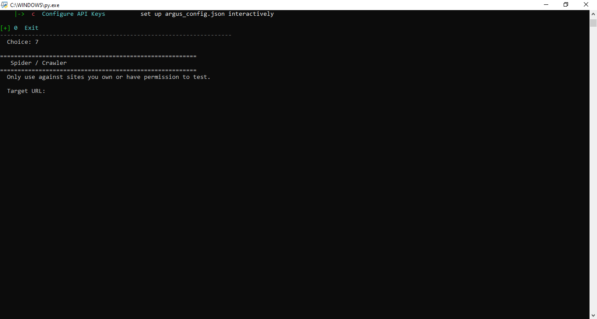 | 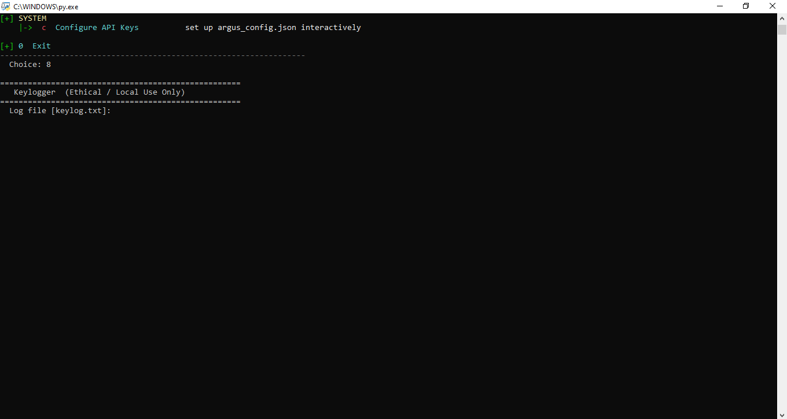 |
| **10 · Network & Recon Tools** | **11 · Password & Hash Tools** |
| 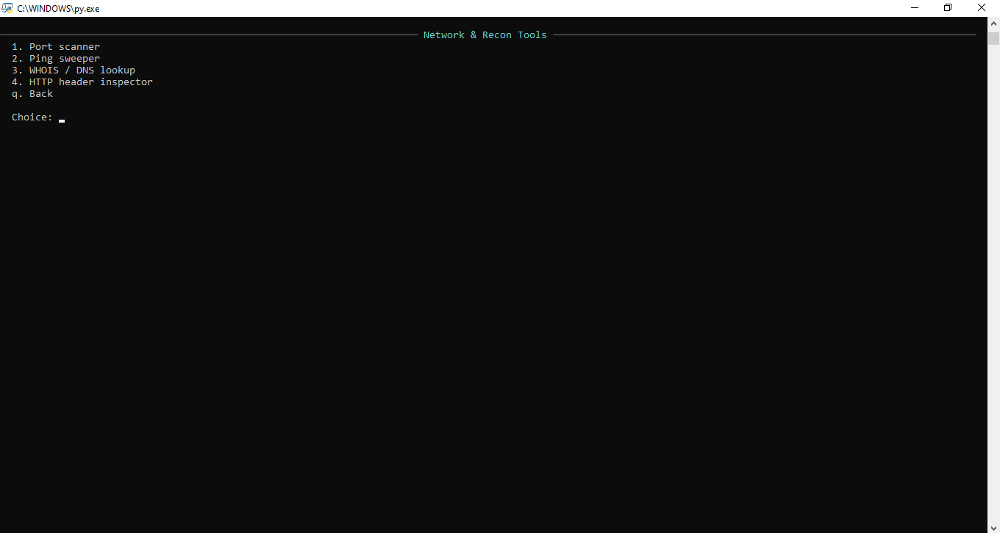 | 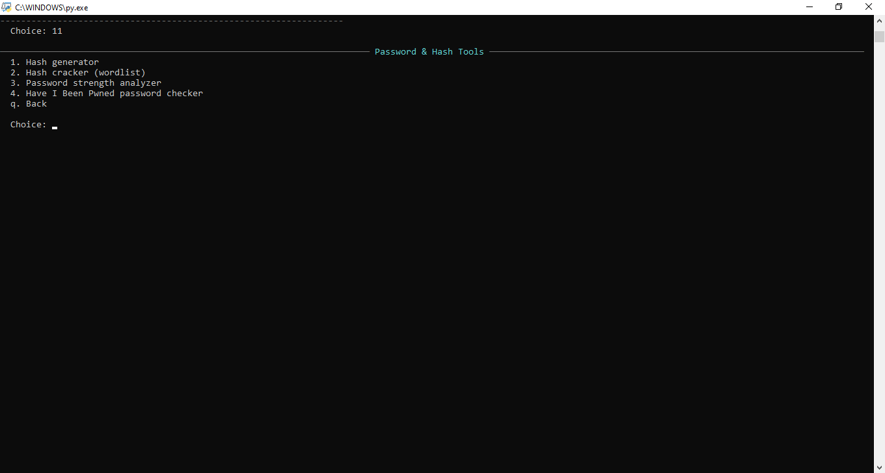 |
| **12 · File & Forensics** | **13 · Authorized Lab Tester** |
| 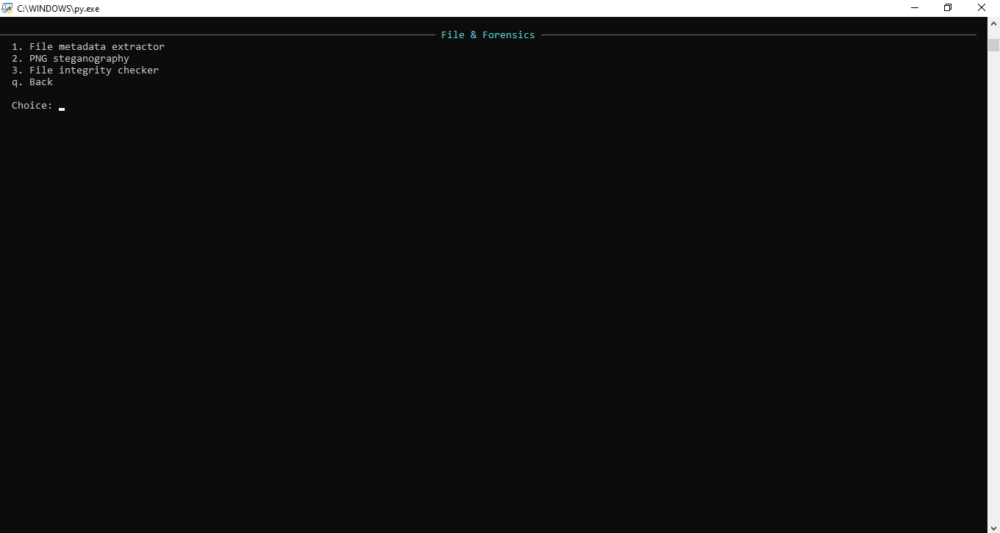 | 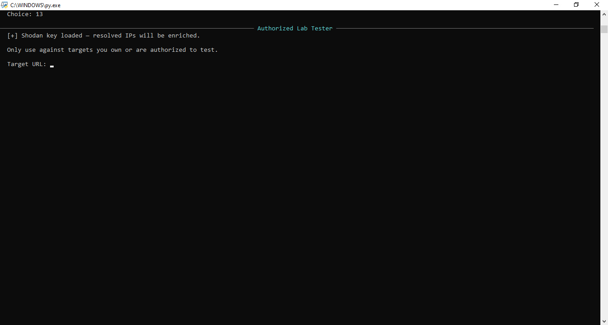 |
| **14 · OSINT Toolkit** | **15 · SSL/TLS Inspector** |
| 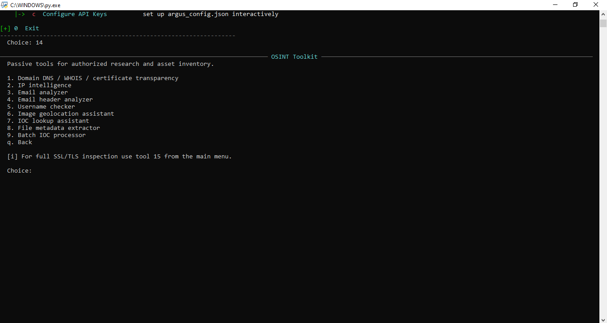 | 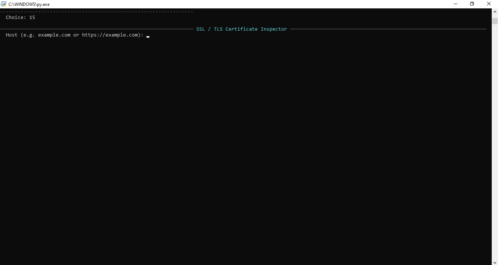 |
| **16 · Reverse Shell Generator** | **17 · Directory Brute Forcer** |
|  | 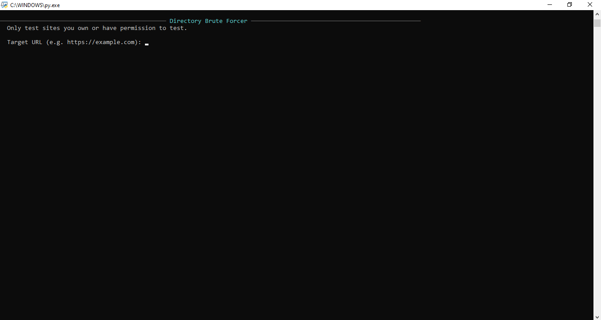 |
| **18 · Subdomain Enumerator** | **19 · CVE / NVD Lookup** |
| 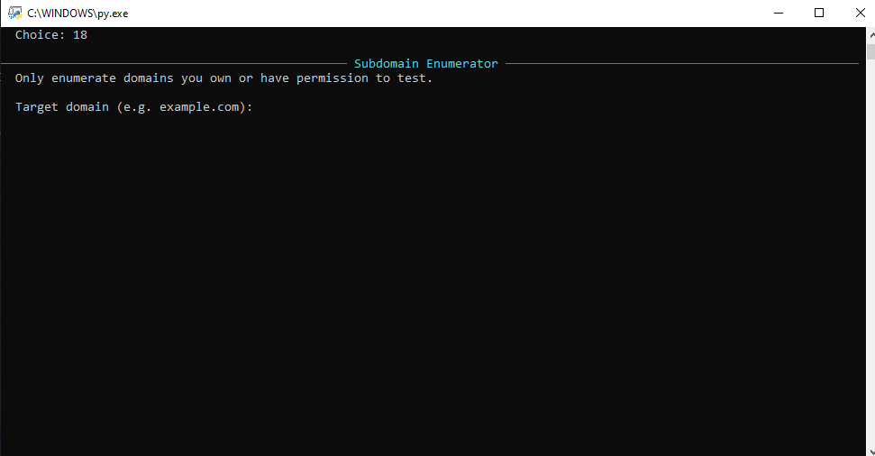 | 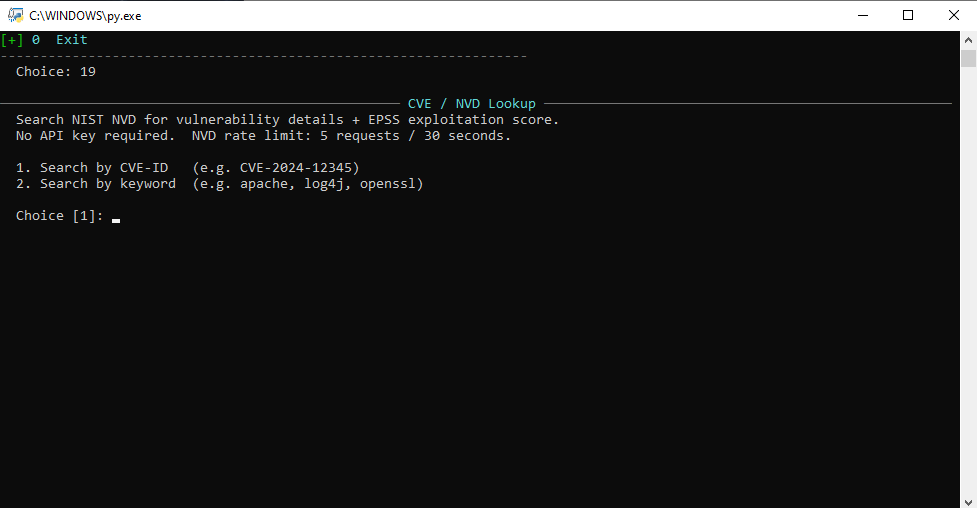 |
| **20 · Cloud Security Checker** | |
| 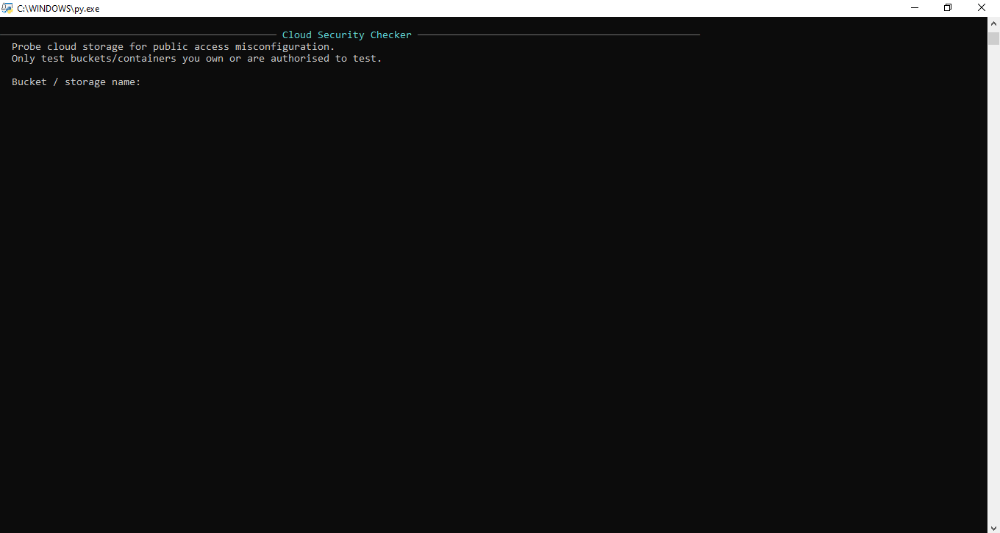 | |

</details>

---

## Features at a Glance

| Category | Tools |
|---|---|
| Cryptography | AES-256, RSA, SHA family, Vigenère, Caesar, XOR, substitution cipher |
| Encoding | Base64, URL, HTML, Hex, Binary, ROT13, ROT47, Morse, JWT |
| JWT Attacks | alg=none, algorithm confusion (RS256→HS256), JWK injection, payload forge |
| Network | Live packet sniffer (BPF), PCAP/PCAPNG analysis, C2 beacon detection |
| Web | 20-check vulnerability scanner, HTTP repeater, spider/crawler |
| OSINT | Domain, IP, email, username, image GPS, IOC enrichment, batch processing |
| Recon | Port scanner, ping sweeper, WHOIS/DNS, HTTP headers |
| Forensics | Metadata extraction, LSB steganography, SHA-256 integrity manifests |
| Password | Generator, strength analysis, wordlist hash cracker, HIBP checker |
| Threat Intel | CVE/NVD lookup with EPSS score, cloud storage misconfiguration checks |
| API Integrations | AbuseIPDB, VirusTotal, Shodan, Censys, URLhaus, MalwareBazaar, HIBP |

---

## Requirements

**Python:** 3.8 or higher

**Core dependencies** (required for most tools):
```
requests>=2.32.0
rich>=13.0.0
beautifulsoup4>=4.12.0
scapy>=2.5.0
```

**Optional capability packs** — install only what you need:

| Extra | Packages | Unlocks |
|---|---|---|
| `[crypto]` | `cryptography` | AES-256, RSA, PBKDF2, JWT attacks |
| `[passwords]` | `zxcvbn` | Realistic password strength scoring |
| `[keylogger]` | `pynput`, `pyperclip` | Keylogger (own machine only) |
| `[pcap]` | `dpkt`, `numpy` | PCAP analysis, C2 beacon Tier 2 stats |
| `[osint]` | `Pillow`, `dnspython`, `python-whois` | Image GPS, full DNS, WHOIS |
| `[web]` | `sslyze`, `fake-useragent`, `wappalyzer-python`, `playwright` | Deep TLS, tech fingerprinting, JS crawling |
| `[all]` | All of the above | Everything |

---

## Installation

**Clone the repo:**
```bash
git clone https://github.com/derianfarley/argus.git
cd argus
```

**Install core dependencies:**
```bash
pip install -r requirements.txt
```

**Or install a specific capability pack:**
```bash
pip install ".[crypto]"
pip install ".[osint]"
pip install ".[all]"
```

**If you installed the `[web]` extra, install the Playwright browser:**
```bash
playwright install chromium
```

**On Linux, packet capture requires root or the `cap_net_raw` capability:**
```bash
sudo python argus.py
# or
sudo setcap cap_net_raw+eip $(which python3)
```

---

## Configuration

Several tools can optionally query external threat intelligence APIs. API keys are stored in `argus_config.json` in the same directory as `argus.py`. The easiest way to set this up is the built-in wizard:

```
python argus.py   →   c (Configure API Keys)
```

The wizard walks through each key with a masked preview and writes the file for you. You can also create it manually:

```json
{
  "abuseipdb_key":  "your-key-here",
  "virustotal_key": "your-key-here",
  "shodan_key":     "your-key-here",
  "urlhaus_key":    "your-key-here",
  "censys_pat":     "your-personal-access-token"
}
```

All API keys are optional — every tool works without them and falls back gracefully. Keys that are present are automatically used wherever they apply (IOC lookups, port scanner enrichment, WHOIS lookups, etc.).

> **Security note:** `argus_config.json` is read at runtime only. A `_scrub_key()` helper strips API key values from any exception messages before they are printed, preventing accidental leakage in error output.

---

## Usage

### Interactive Menu

```bash
python argus.py
```

This launches the main interactive menu with all 20 tools grouped by category. Navigate with the number or letter shown next to each tool, and press `q` to go back from any sub-menu.

### CLI Mode

Argus also exposes a non-interactive command-line interface for scripting and automation:

**Web vulnerability scan:**
```bash
python argus.py scan --url https://example.com --all
python argus.py scan --url https://example.com --sqlmap --no-db
```

**Hash text or a file:**
```bash
python argus.py hash --text "hello world"
python argus.py hash --file /path/to/file.bin --algorithm sha512
```
Supported algorithms: `sha1`, `sha224`, `sha256`, `sha384`, `sha512`, `sha3_256`, `sha3_512`, `blake2b`

**Inspect a JWT:**
```bash
python argus.py jwt eyJhbGciOiJIUzI1NiIsInR5cCI6IkpXVCJ9...
```

**Generate a password:**
```bash
python argus.py password --length 32
```

---

## Tool Reference

---

### 1. Cryptography Toolkit

**Main menu → `1`**


A hub for eight cryptographic tools covering both educational and production-grade algorithms.

#### 1.1 Substitution Cipher
A classic monoalphabetic substitution cipher using a reverse-alphabet key. Supports encrypt and decrypt on typed text or files. Clearly labeled as a toy/demo cipher — AES-256 is recommended for anything real.

#### 1.2 AES-256 File Encryption / Decryption
Production-grade symmetric encryption using AES-256-GCM via the `cryptography` library.
- PBKDF2-HMAC-SHA256 key derivation with a random 16-byte salt
- A random 12-byte nonce is generated per encryption
- Salt and nonce are prepended to the output file so decryption is self-contained
- Loads the full file into memory before encrypting — suitable for most file sizes; very large files (several GB+) will use proportional RAM

Requires: `pip install cryptography`

#### 1.3 RSA Keypair + Text Encryption / Decryption
Generates a 3072-bit (default) or 4096-bit RSA keypair using OAEP padding with SHA-256.
- Saves public and private keys to PEM files
- Encrypts short messages using the public key
- Decrypts ciphertext using the private key
- Maximum message length is ~318 bytes (3072-bit) or ~446 bytes (4096-bit) due to OAEP-SHA256 overhead

Requires: `pip install cryptography`

#### 1.4 SHA-Family Hashing
Hashes typed text using MD5, SHA-1, SHA-256, SHA-512, SHA3-256, or BLAKE2b. Outputs the hex digest. Uses Python's `hashlib` — no extra dependencies.

#### 1.5 Vigenère Cipher
A polyalphabetic substitution cipher using a repeating keyword.
- Encrypts and decrypts alphabetic text
- Non-alphabetic characters pass through unchanged
- Accepts any length keyword

#### 1.6 Caesar Brute-Forcer
Tries all 25 possible Caesar shifts on ciphertext and scores each result against expected English letter frequencies. Outputs all 25 candidates ranked by score so the most likely plaintext is easy to identify.

#### 1.7 XOR Cipher
Manual XOR encryption and decryption using a user-supplied hex key. Outputs ciphertext as a hex string and can decode it back. Useful for understanding basic symmetric operations and CTF challenges.

#### 1.8 XOR Brute-Forcer + Frequency Analysis
Automated multi-byte XOR key recovery using the Hamming distance / normalized edit distance method.
- Detects likely key length by comparing edit distances between ciphertext blocks
- Recovers each key byte independently using English letter frequency analysis
- Supports single-byte brute-force with scoring and multi-byte keys up to a configurable maximum
- Shows top candidate plaintexts with their recovered keys

---

### 2. Password Generator

**Main menu → `2`**


Generates cryptographically random passwords using `secrets.choice()`.

- Choose which character classes to include: uppercase, lowercase, digits, symbols
- Set a custom length (minimum enforced per class selection)
- Strength is scored using **zxcvbn** if installed, or falls back to Shannon entropy
- The zxcvbn score (0–4), estimated offline crack time, and any detected patterns (keyboard walks, common words, dates) are displayed
- Results can be copied to clipboard if `pyperclip` is installed

Requires for full scoring: `pip install zxcvbn`

---

### 3. Encoder / Decoder

**Main menu → `3`**


Multi-format encoder and decoder supporting nine formats, all using the Python standard library — no extra dependencies.

#### Formats

| # | Format | Notes |
|---|---|---|
| 1 | Base64 | Standard RFC 4648 encode/decode |
| 2 | URL Encoding | Percent-encoding (encode/decode) |
| 3 | HTML Entities | Entity escape/unescape |
| 4 | Hex | Text ↔ hex byte string |
| 5 | Binary | Text ↔ 8-bit binary string |
| 6 | ROT13 | Symmetric letter rotation |
| 7 | ROT47 | Symmetric rotation across all printable ASCII |
| 8 | Morse Code | Text ↔ dot/dash encoding |
| 9 | JWT | Inspector + six attack modes (see below) |

#### JWT Tools (sub-menu of format 9)

Argus includes a dedicated JWT attack toolkit for authorized security testing:

| # | Attack | Description |
|---|---|---|
| 1 | **Inspect** | Decode header/payload, flag weak algorithms (`none`, `HS256` on public endpoints), check expiry and standard claims |
| 2 | **alg=none strip** | Remove the signature and set `alg` to `none`, forging a token that some libraries accept without verification |
| 3 | **Edit payload + alg=none** | Modify any claim in the payload (e.g. `"role": "admin"`) and strip the signature |
| 4 | **Re-sign with known secret** | Forge a new payload signed with a known HMAC secret — useful for verifying token validation logic |
| 5 | **RS256 → HS256 confusion** | Algorithm confusion attack: takes the RSA public key and re-signs the token using it as the HMAC secret, exploiting libraries that don't enforce the expected algorithm |
| 6 | **JWK injection** | Embeds an attacker-controlled RSA key in the JWT header under the `jwk` claim, tricking vulnerable libraries into trusting your own key |

---

### 4. Packet Analysis

**Main menu → `4`**


A hub for three network packet tools.

#### 4.1 Live Packet Sniffer (scapy)

Real-time packet capture with a BPF filter interface.
- Accepts any valid BPF expression (`tcp`, `udp port 53`, `host 8.8.8.8`, `icmp`, etc.)
- Displays each packet's timestamp, protocol, source, destination, flags, and payload preview
- Detects ARP spoofing by comparing ARP reply MAC addresses against a live table
- Tracks TCP streams and displays reassembled payloads for streams with printable content
- Captures until a count is reached or `Ctrl+C`

Requires: `pip install scapy` and root/sudo on Linux/macOS

#### 4.2 PCAP / PCAPNG Analyzer (dpkt)

Offline analysis of saved capture files.
- Reads `.pcap` and `.pcapng` files without requiring a live network interface
- Reconstructs TCP streams and displays connection summaries
- Shows protocol distribution, top talkers, and a timeline of traffic
- Saves a formatted analysis report to the SQLite results database

Requires: `pip install dpkt`

#### 4.3 C2 Beacon Detector

Multi-dimensional statistical analysis of network traffic for command-and-control beaconing patterns. Can analyze a PCAP file or perform live capture.

**Tier 1 analysis (always active):**
- Coefficient of variation (CV) of inter-packet intervals — regular beacons have CV < 0.2
- Packet count and flow duration
- Port classification (common C2 ports: 4444, 8080, 443, 1337, etc.)
- Payload size coefficient of variation

**Tier 2 analysis (requires `numpy`):**
- Fast Fourier Transform (FFT) — identifies dominant periodic frequencies in the interval series
- Autocorrelation — detects periodicity that FFT may miss in noisy signals
- Shannon entropy of payload sizes — low entropy suggests templated C2 traffic
- Interval histogram visualization with ASCII bar chart

**API enrichment (optional, keys from `argus_config.json`):**
- AbuseIPDB: abuse confidence score for each destination IP
- VirusTotal: detection ratio for destination IPs
- Shodan/InternetDB: open ports and known CVEs on destination hosts

Each flow is scored and classified as HIGH, MEDIUM, or LOW confidence beacon.

Requires: `pip install scapy` and optionally `pip install numpy`

---

### 5. Web Vulnerability Scanner

**Main menu → `5`**


A comprehensive web application scanner with 20 individual checks grouped into five categories. Supports three scan profiles plus fully custom check selection.

**Scan profiles:**
- **Quick** — transport checks (HTTP→HTTPS, SSL/TLS), headers, server disclosure, cookies, WAF detection, technology fingerprinting, well-known files
- **Standard** — all Quick checks plus: CORS, dangerous HTTP methods, sensitive paths, robots.txt, directory listing, open redirect, rate limiting, reflected XSS, CSRF detection, SSRF scan
- **Deep** — all Standard checks plus SSLyze deep TLS scan; sqlmap must be explicitly opted into regardless of profile
- **Custom** — prompted to enable or disable each of the 20 checks individually with a y/n prompt

#### Transport & TLS
- **(A) HTTP → HTTPS redirect** — verifies the server enforces HTTPS by following the redirect chain from the plain HTTP version
- **(B) SSL/TLS certificate inspection** — checks certificate expiry, deprecated protocol versions, and weak cipher suites

#### HTTP Headers
- **(C) Security headers** — checks for presence and correctness of: `Strict-Transport-Security`, `Content-Security-Policy`, `X-Frame-Options`, `X-Content-Type-Options`, `X-XSS-Protection`, `Referrer-Policy`, `Permissions-Policy`
- **(D) Server information disclosure** — flags `Server`, `X-Powered-By`, `X-AspNet-Version`, and similar headers that reveal technology stack details
- **(E) CORS policy** — detects wildcard `Access-Control-Allow-Origin: *`, and the dangerous combination of wildcard origin with `Access-Control-Allow-Credentials: true`
- **(F) Dangerous HTTP methods** — probes for `TRACE`, `CONNECT`, `DELETE`, `PUT`, and `PATCH` being publicly accepted

#### Cookies
- **(G) Cookie security flags** — inspects every `Set-Cookie` header for missing `Secure`, `HttpOnly`, and `SameSite` attributes

#### Content & Paths
- **(H) Sensitive file/path exposure** — probes 44 common sensitive paths including `.env`, `.git/HEAD`, `phpinfo.php`, database dump patterns, admin panels, Spring Boot actuator endpoints, API documentation, backup file extensions, and more
- **(I) Robots.txt disclosure** — fetches and parses `robots.txt`, flagging `Disallow` entries that contain sensitive keywords
- **(J) Directory listing detection** — checks 20 common directory paths for Apache/Nginx directory index responses (`Index of /`)
- **(K) Open redirect scan** — tests 14 common redirect parameters (`next`, `url`, `redirect`, `goto`, `return_to`, etc.) with a canary destination to detect unvalidated redirect logic

#### Infrastructure
- **(L) Rate limiting detection** — checks for `X-RateLimit-*` and `Retry-After` headers, then sends 15 rapid requests to confirm whether rate limiting is actually enforced
- **(M) WAF / CDN detection** — fingerprints common WAF and CDN products from response headers and body patterns (Cloudflare, ModSecurity, Akamai, Imperva, AWS WAF, Sucuri, etc.)
- **(N) Technology fingerprinting** — uses `wappalyzer-python` to identify frameworks, CMS, server software, JavaScript libraries, and analytics platforms
- **(O) Deep TLS scan (SSLyze)** — detailed TLS validation including accepted protocol versions, cipher suite enumeration, certificate chain verification, and known-vulnerability checks
- **(P) sqlmap assisted SQLi scan** — launches sqlmap against the target after explicit user confirmation; requires sqlmap to be installed separately
- **(Q) Reflected XSS parameter probe** — injects a unique canary string into URL parameters and checks if it appears in the response unescaped
- **(R) Well-known files & manifests** — probes `/.well-known/security.txt`, `/.well-known/openid-configuration`, `/.well-known/jwks.json`, and similar discovery endpoints for exposed configuration and service metadata
- **(S) CSRF detection** — passively inspects HTML forms in the response for missing or weak CSRF tokens; flags POST forms that lack any anti-forgery mechanism
- **(T) SSRF parameter scan** — injects out-of-band probe URLs into common request parameters to detect server-side request forgery vulnerabilities in form inputs and query parameters

All findings are tagged `CRITICAL / HIGH / MEDIUM / LOW / INFO`, displayed grouped by severity with a remediation tip for each finding. Where applicable, findings are also tagged with their relevant MITRE ATT&CK technique identifier. Reports can be saved to a timestamped `.txt` file and are always saved to the SQLite results database for later comparison.

Requires: `pip install requests`

---

### 6. HTTP Repeater

**Main menu → `6`**


Build, send, and iteratively modify HTTP requests without leaving Argus.

- Select method from: GET, POST, PUT, DELETE, PATCH, HEAD, OPTIONS
- Provide a URL (HTTPS is assumed if no scheme is given)
- Add custom headers one per line (`Name: Value` format)
- For POST, PUT, PATCH: provide an optional request body
- After each response, view the status code, all response headers, and the full body
- Choose to resend the same request, modify it, or return to the menu

Useful for manually confirming vulnerabilities, testing endpoint behavior, tweaking captured requests, and verifying patches.

Requires: `pip install requests`

---

### 7. Spider / Crawler

**Main menu → `7`**


Crawl a web application and map its full attack surface using breadth-first search.

**What it discovers:**
- **Internal links** — every page on the same domain
- **External links** — third-party domains linked from the target
- **Forms** — action URL, HTTP method, and all named input fields (useful for finding injection points)
- **Interesting URLs** — paths matching sensitive keywords: `admin`, `login`, `signin`, `auth`, `api`, `upload`, `file`, `dashboard`, `panel`, `config`, `backup`, `export`, `download`, `debug`, `test`, `dev`, `staging`, `internal`, `private`, `password`, `passwd`, `token`, `key`, `secret`, `credentials`

**Configuration:**
- Max depth: 1–5 levels (default 2)
- Max pages: configurable limit to avoid runaway crawls
- Optional Playwright mode for JavaScript-rendered pages — crawls Single Page Applications that return empty HTML to a regular GET request

Results can be saved to a timestamped `.txt` file.

Requires: `pip install requests beautifulsoup4`
Requires for JS mode: `pip install playwright && playwright install chromium`

---

### 8. Keylogger

**Main menu → `8`**


A keystroke logger intended exclusively for monitoring your own machine — for research, forensics demonstration, or monitoring authorized lab environments.

- Captures all keystrokes with timestamps using `pynput`
- Tracks active window title changes on supported platforms:
  - Windows: via `pygetwindow`
  - Linux: via `xdotool` (if installed)
  - macOS: via AppleScript through `subprocess`
- Monitors clipboard content changes via `pyperclip`
- Runs until **ESC** is pressed
- Session statistics on exit: total keystrokes, unique keys, words per minute, most frequent keys, and window switches

Requires: `pip install pynput pyperclip`
Windows only: `pip install pygetwindow`

> Logs only your own machine. No network transmission. Output is saved locally.

---

### 9. Results Database

**Main menu → `9`**

All Argus tools that produce structured output automatically save their results to a local SQLite database (`argus_results.db`). The Results Database tool provides an interface to review and export saved scans.

- **Browse recent runs** — lists the 20 most recent saved runs with tool name, target, timestamp, and summary
- **View a run** — displays the full saved report for any run by ID
- **Compare two runs** — diffs the findings from two saved scan reports, highlighting new and resolved issues (useful for tracking remediation progress)
- **Export to .txt** — saves a run's full report to a plain text file
- **Export to HTML** — generates a styled HTML report with colour-coded severity sections

---

### 10. Network & Recon Tools

**Main menu → `10`**


A sub-menu hub for four network reconnaissance tools.

#### 10.1 Port Scanner
Concurrent TCP port scanner using `ThreadPoolExecutor`.
- Accepts a target host and a port range (e.g. `1-1024`) or comma-separated list
- Common service names are resolved from a built-in table (HTTP, HTTPS, SSH, FTP, SMB, RDP, MySQL, etc.)
- If a Shodan API key is configured, results are enriched with banner data and known CVEs from Shodan
- For authorized use on hosts you own or have permission to scan

#### 10.2 Ping Sweeper
ICMP ping sweep across a subnet to discover live hosts.
- Accepts CIDR notation (e.g. `192.168.1.0/24`)
- Pings every host address concurrently via the OS ping utility
- Lists responsive hosts with round-trip time

#### 10.3 WHOIS / DNS Lookup
Comprehensive domain and IP lookup tool.
- Resolves A, AAAA, MX, NS, TXT, and CNAME records via `dnspython`
- Retrieves WHOIS registration data via `python-whois`
- Optionally enriches IP results with Shodan host data if an API key is configured
- Results are saved to the SQLite results database

#### 10.4 HTTP Header Inspector
Fetch and display all HTTP response headers for a target URL.
- Colour-coded output distinguishes security-relevant headers (HSTS, CSP, X-Frame-Options, etc.) from informational and server-disclosure headers
- No analysis — shows raw headers exactly as returned

---

### 11. Password & Hash Tools

**Main menu → `11`**


A sub-menu for four password and hash utilities.

#### 11.1 Hash Generator
Hash text or a file using a selectable algorithm.
- Algorithms: MD5, SHA-1, SHA-256, SHA-512, SHA3-256, BLAKE2b
- For files: reads in 1 MB chunks to handle arbitrarily large inputs without loading them into memory

#### 11.2 Hash Cracker (Wordlist)
Dictionary-based hash cracker with automatic algorithm detection.
- Accepts a hash value and infers likely algorithms from its length and character set
- Accepts any wordlist file (one candidate per line)
- Tests each wordlist candidate against all inferred algorithms sequentially, with a live Rich progress bar showing words checked and current candidate
- Prints the plaintext on the first match and stops

> For use only on hashes you own or are authorized to test.

#### 11.3 Password Strength Analyzer
Score a password's strength and estimate crack time.
- Password is entered via `getpass` — not echoed to the terminal
- Scored with **zxcvbn** if installed (score 0–4, with specific pattern warnings: keyboard walks, common words, dates, repeated patterns, etc.)
- Falls back to Shannon entropy calculation if zxcvbn is unavailable
- Displays estimated offline crack time at current GPU cracking rates

#### 11.4 Have I Been Pwned Password Checker
Check a password against the HIBP breach database using k-anonymity.
- Only the first 5 characters of the SHA-1 hash are sent to the HIBP API — the full hash never leaves the machine
- Reports how many times the password appears across all known breach datasets
- The plaintext password is never transmitted or logged

---

### 12. File & Forensics

**Main menu → `12`**


A sub-menu for three file and forensics tools.

#### 12.1 File Metadata Extractor
Extract filesystem and EXIF metadata from any file.
- OS-level stats for any file type: size, created, modified, and accessed timestamps
- For images: full EXIF extraction via Pillow including camera make/model, GPS coordinates, exposure settings, focal length, and software tags
- Results are saved to the SQLite results database

Requires for EXIF: `pip install Pillow`

#### 12.2 PNG Steganography (LSB)
Hide or extract a secret text message inside a PNG image using least-significant bit encoding.

**Hide mode:**
- Encodes a UTF-8 message into the LSB of the red, green, and blue channels of each pixel
- Carrier image is visually identical to the original
- Output is always PNG (JPEG compression destroys LSB data)
- Reports capacity used vs. total available

**Reveal mode:**
- Reads the LSBs of each pixel's RGB channels and reconstructs the original message
- Works on any PNG produced by the hide mode

Capacity: approximately `(image width × image height × 3) / 8` bytes.

Requires: `pip install Pillow`

#### 12.3 File Integrity Checker
SHA-256 file integrity baseline and verification tool.

**Baseline mode:**
- Recursively walks a directory and hashes every file
- Saves a JSON manifest with paths, SHA-256 digests, creation timestamp, and root directory
- Skips `.git` and `__pycache__` directories

**Verify mode:**
- Re-hashes the same directory tree and compares against a saved manifest
- Reports counts of: added files, removed files, and modified files (hash mismatch)
- Lists specific file paths for each category (up to 50 per category)

---

### 13. Authorized Lab Tester

**Main menu → `13`**


A passive discovery and harmless probe tool designed for use against controlled lab targets (your own machines or dedicated test environments).

- Resolves the target hostname to all associated IP addresses
- Classifies each IP as public, private, loopback, link-local, or reserved
- Performs a non-destructive HTTP probe (GET /) and reports status code, server header, redirect chain, and page title
- Extracts all links and forms from the landing page without submitting anything
- Results are saved to the SQLite database

---

### 14. OSINT Toolkit

**Main menu → `14`**


A sub-menu hub for eight passive OSINT tools. All tools save results to the SQLite database.

#### 14.1 Domain OSINT
Passive domain intelligence gathering.
- Multi-record DNS resolution: A, AAAA, MX, NS, TXT, CNAME
- WHOIS registration data via `python-whois`
- SPF record analysis — parses mechanisms, detects missing or overly permissive records
- DMARC policy check — flags missing policy, `p=none`, and missing `rua` tags
- Certificate transparency name enumeration via **crt.sh** — finds subdomains and related domains from public CT logs without sending a single packet to the target

#### 14.2 IP Intelligence
IP geolocation and ASN data.
- Resolves domain to IP if a hostname is provided
- Queries ipwho.is for: country, region, city, ASN, ISP, organization, and timezone
- Classifies the address type: public, private, loopback, link-local, multicast, or reserved

#### 14.3 Email Analyzer
Email address OSINT and deliverability assessment.
- Format validation (RFC 5322 parsing via `email.utils`)
- MX record resolution for the domain — verifies mail can actually be delivered
- SPF and DMARC policy check on the sender domain


#### 14.4 Email Header Analyzer
Raw email header forensics.
- Accepts pasted header text or a `.eml` file path
- Parses the full `Received` chain to trace routing hops and timestamps
- Extracts and verifies `Authentication-Results` (SPF, DKIM, DMARC status)
- Flags common spoofing indicators: `From`/`Reply-To` mismatch, `Return-Path` discrepancies, originating IP not matching claimed sender domain

#### 14.5 Username Checker
Passive username presence check across major public platforms.
- Probes well-known profile URL patterns concurrently via `ThreadPoolExecutor`
- HTTP 200 and 403 responses are flagged as likely-present leads for manual review
- HTTP 404 is treated as absent
- Does not log in, authenticate, or interact with any account in any way

#### 14.6 Image Geolocation
Extract and map GPS coordinates from image EXIF metadata.
- Accepts JPEG and TIFF files with embedded GPS EXIF tags
- Reads `GPSLatitude`, `GPSLongitude`, and reference tags
- Converts degrees/minutes/seconds (DMS) to decimal degrees
- Generates a direct Google Maps link for the location
- Displays full EXIF dump alongside GPS data

Requires: `pip install Pillow`

#### 14.7 IOC Lookup Assistant
Multi-source indicator of compromise enrichment. Auto-classifies the indicator type (IP, domain, URL, MD5, SHA-1, SHA-256) then queries the appropriate APIs.

**For IP addresses:**
- AbuseIPDB: abuse confidence score and report count
- Shodan/InternetDB: open ports and known CVEs (no API key required for InternetDB)
- Shodan host API: full banner data if a `shodan_key` is configured
- Censys Platform API (`api.platform.censys.io/v3`): port and service data using Bearer PAT authentication

**For URLs and domains:**
- URLhaus: malware hosting and phishing classification
- VirusTotal: detection ratio across all available AV engines and URL scanners

**For file hashes (MD5, SHA-1, SHA-256):**
- MalwareBazaar: file name, type, malware signature, tags, and first seen date
- VirusTotal: detection ratio and malware family classification

All API errors have the key value scrubbed from the error message before display.

#### 14.8 Batch IOC Processor
Process a list of IOCs from a text file (one per line) through the full IOC lookup pipeline automatically.
- Auto-classifies each indicator
- Queries all configured APIs for each indicator
- Displays a structured summary table with verdict (clean/suspicious/malicious/unknown) and detection counts
- Saves the complete report to the SQLite database

---

### 15. SSL/TLS Inspector

**Main menu → `15`**


Deep-dive SSL/TLS inspection using Python's built-in `ssl` module — no extra dependencies required.

- Accepts a hostname, URL, or `host:port`
- Connects and retrieves the full certificate details: subject, issuer, all SANs (Subject Alternative Names), serial number, validity dates, and days until expiry
- Shows the negotiated TLS protocol version (TLS 1.0 / 1.1 / 1.2 / 1.3)
- Shows the active cipher suite and key exchange mechanism
- Flags common misconfigurations: expired certificates, certificates expiring within 30 days, deprecated TLS 1.0/1.1, certificates issued by unknown/self-signed CAs

---

### 16. Reverse Shell Generator

**Main menu → `16`**


Generates reverse-shell one-liners for authorized penetration testing and CTF use. Nothing is executed — payloads are displayed for copy/paste only.

Input LHOST (your listener IP) and LPORT (default 4444), then Argus generates payloads for:

| # | Language / Method |
|---|---|
| 1 | Bash (TCP) |
| 2 | Bash (UDP) |
| 3 | Python 3 |
| 4 | Perl |
| 5 | PHP |
| 6 | Ruby |
| 7 | nc (traditional, with `-e`) |
| 8 | nc (pipe method, no `-e` required) |
| 9 | PowerShell (TCP, bypasses execution policy) |

If `pyperclip` is installed, any payload can be copied directly to the clipboard by entering its number.

The suggested netcat listener command is always displayed: `nc -lvnp <LPORT>`

> For authorized use in penetration testing engagements and CTF competitions only.

---

### 17. Directory Brute Forcer

**Main menu → `17`**


Discover hidden files and directories on a web server using a wordlist.

- Accepts any wordlist file (one path per line), or uses the built-in 115-word compact list covering common admin panels, API endpoints, CMS paths, backup files, config files, and more
- Concurrent requests via `ThreadPoolExecutor` for speed
- Configurable thread count and timeout
- Filters by status code — flags 200, 201, 204, 301, 302, 307, 403 responses
- Reports status code, content length, and final URL after redirects
- Results saved to the SQLite database

Requires: `pip install requests`

> For authorized use on servers you own or have permission to test.

---

### 18. Subdomain Enumerator

**Main menu → `18`**


Discover subdomains via two methods, optionally combined.

**DNS wordlist bruteforce:**
- Resolves `<word>.<domain>` via DNS for each word in the built-in list (110 common subdomains) or a custom wordlist
- Built-in list covers: `www`, `mail`, `api`, `dev`, `staging`, `prod`, `admin`, `vpn`, `ci`, `jenkins`, `git`, `gitlab`, `ftp`, `intranet`, `corp`, `office`, and many more
- Concurrent resolution via `ThreadPoolExecutor` with live progress

**Certificate Transparency logs (crt.sh):**
- Passively queries crt.sh for `%.domain` to find all names from issued certificates
- No packets sent to the target domain
- Often surfaces subdomains that DNS wordlists would never guess

**HTTP probe (optional):**
- For each discovered hostname, probes HTTP and HTTPS to find live services
- Reports status code, redirect destination, and page title

Results are saved to the SQLite database.

---

### 19. CVE / NVD Lookup

**Main menu → `19`**


Search the NIST National Vulnerability Database directly from Argus. No API key required. NVD rate limit is 5 requests per 30 seconds.

**Search modes:**
- **By CVE-ID** — exact lookup for a specific CVE (e.g. `CVE-2024-12345`)
- **By keyword** — full-text search across NVD (e.g. `log4j`, `apache`, `openssl`) with configurable result limit

**For each CVE found, Argus displays:**
- CVE ID
- CVSS base score and severity (prefers v3.1, falls back to v3.0, v4.0, v2)
- CVSS vector string
- CWE classification(s)
- Published and last-modified dates
- Full English description
- **EPSS score** (Exploit Prediction Scoring System from first.org) — probability of exploitation in the next 30 days, with percentile rank and a triage flag (HIGH / Moderate / Low exploitation probability)

All results are saved to the SQLite database.

---

### 20. Cloud Security Checker

**Main menu → `20`**


Probe cloud storage services for public access misconfiguration. Tests six endpoints across three providers — no cloud API keys required.

| Provider | Endpoint | Detection Method |
|---|---|---|
| AWS S3 | Virtual-hosted style (`https://<name>.s3.amazonaws.com/`) | XML `ListBucketResult` in response |
| AWS S3 | Path-style (`https://s3.amazonaws.com/<name>/`) | XML listing |
| Azure Blob | Container list (`?restype=container&comp=list`) | HTTP status + XML |
| Azure Blob | Static website (`$web`) | HTTP 200 response |
| GCP | XML API (`storage.googleapis.com/<name>/`) | XML `ListBucketResult` |
| GCP | JSON API (`/storage/v1/b/<name>/o`) | JSON kind field |

For each endpoint, reports: HTTP status code, whether a public listing was detected, and the full URL tested. Flagged endpoints are presented as HIGH severity findings.

> Only test buckets and containers you own or are authorized to test.

---

### System: Configure API Keys

**Main menu → `c`**

An interactive wizard for setting up `argus_config.json`.

- Displays the current masked value of each key (last 4 characters visible)
- Prompts for each key in sequence with a description of which tools use it
- Supports updating individual keys without resetting others
- Writes the updated JSON to `argus_config.json`

**Supported keys:**

| Key | Used by |
|---|---|
| `abuseipdb_key` | IOC Assistant (IP lookups), C2 Beacon Detector |
| `virustotal_key` | IOC Assistant (IPs, domains, URLs, hashes), Batch IOC Processor |
| `shodan_key` | IOC Assistant (host data), Port Scanner (CVE enrichment), WHOIS/DNS |
| `urlhaus_key` | IOC Assistant (URL/domain lookups) |
| `censys_pat` | IOC Assistant (IP service data via Censys Platform API v3) |


All keys are optional — every tool works without them and falls back gracefully.

---

## Project Structure

```
argus/
├── argus.py              # Single-file application (~10,600 lines)
├── pyproject.toml        # PEP 621 packaging metadata + optional extras
├── requirements.txt      # Dependency list with capability annotations
├── README.md             # This file
├── docs/
│   └── screenshots/        # Tool preview images
└── argus_config.json     # API keys (created by setup wizard, not committed)
```

`argus_results.db` is created automatically in the working directory on first run.

---

## License

MIT License — see [LICENSE](LICENSE) for details.

---

*Built by [Derian Farley](https://github.com/derianfarley)*
